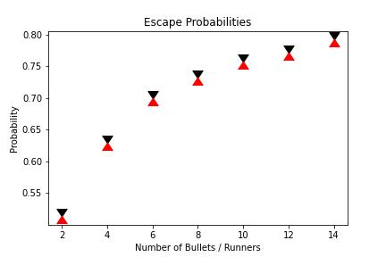

# Experimental Approximations
| N	| p	|
| ----- | ----- |
| 2 	| 0.5	|
| 4 	| 0.625	|
| 6 	| 0.69	|
| 8 	| 0.72	|
| 10 	| 0.75	|

# Simulation Method
`python bullets.py > output.txt`

# Linear Calculation Method
`python lines.py > output.txt`
